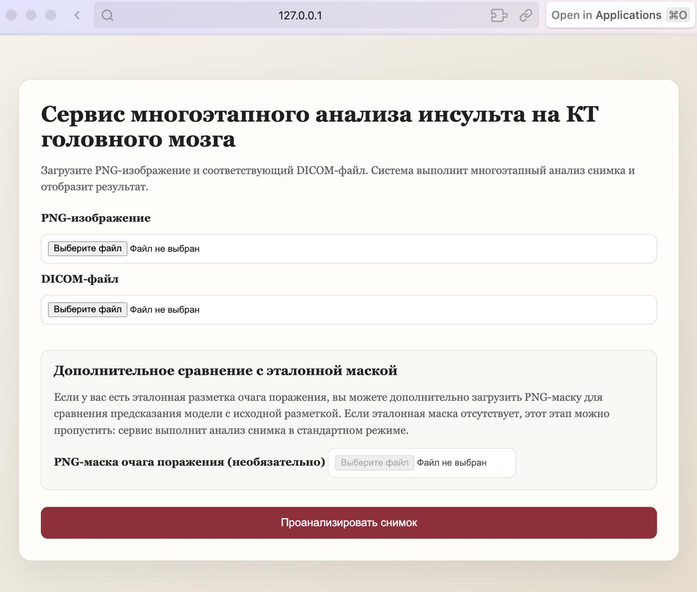
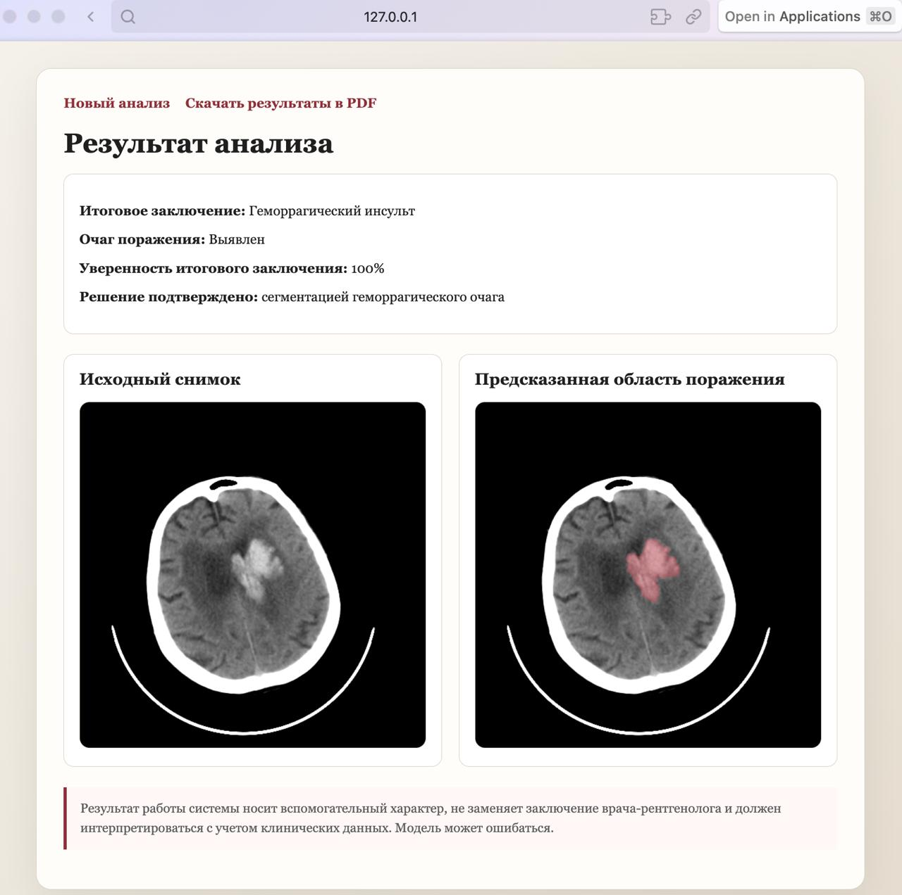
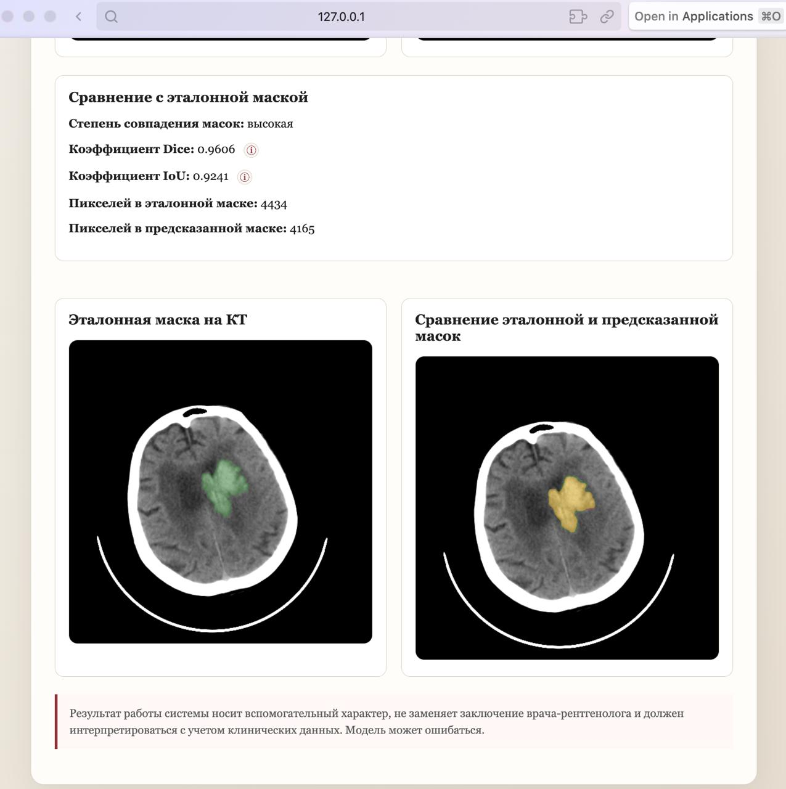
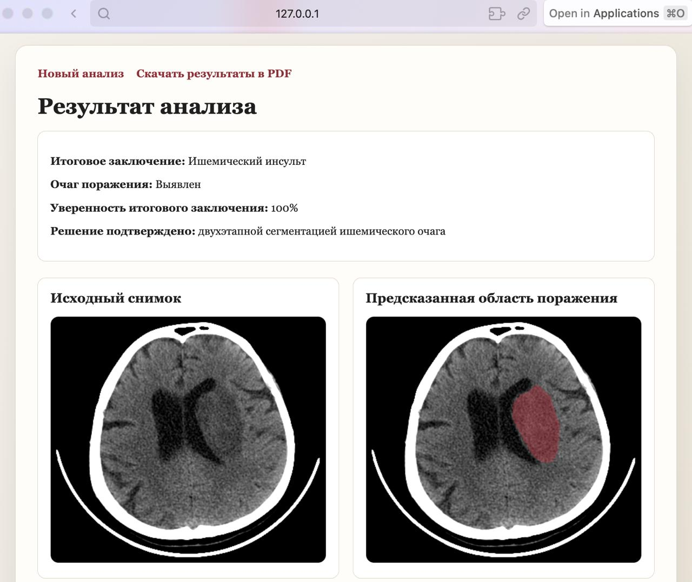
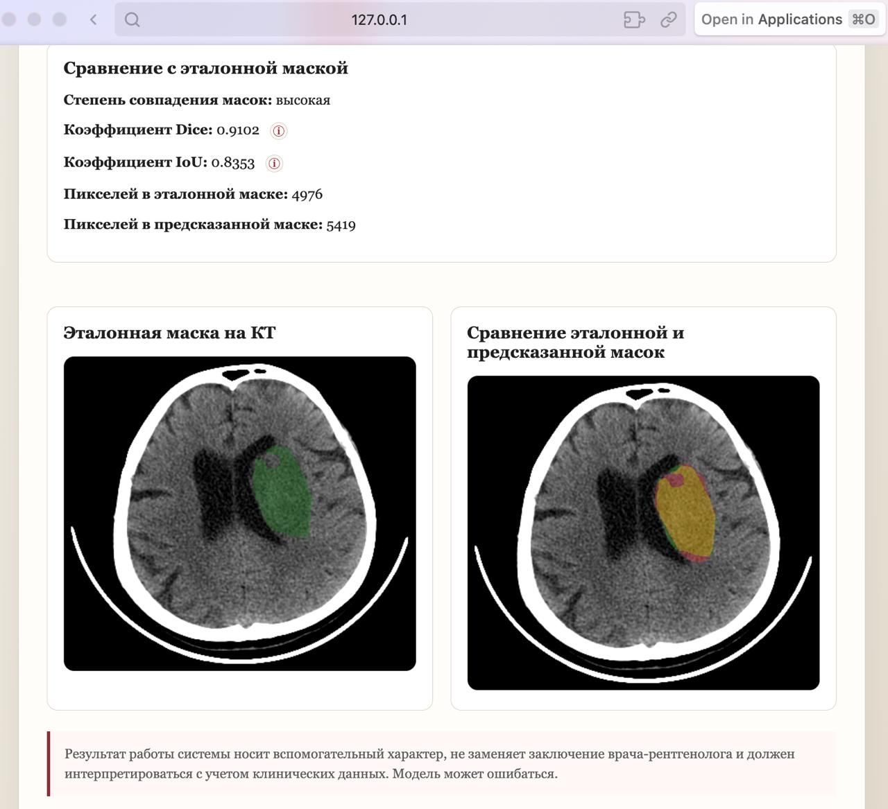

# Автоматизированный многоэтапный анализ инсульта по данным КТ головного мозга

Автоматизированная система для многоэтапного анализа изображений компьютерной томографии головного мозга с целью обнаружения инсульта, определения его типа и сегментации областей поражения.

В проекте реализована **каскадная архитектура**, в которой результат работы одной модели определяет дальнейший этап обработки. Система объединяет классификацию изображений, семантическую сегментацию, предварительную обработку DICOM-данных и FastAPI-сервис для инференса.

> **Исследовательский прототип.** Система предназначена для учебных и исследовательских целей и не является медицинским диагностическим инструментом.

## Общая схема работы

Система обрабатывает КТ-исследование в несколько этапов:

```text
PNG + DICOM
     │
     ▼
┌──────────────────────────┐
│ 1. Бинарная классификация│
│    Инсульт / Норма       │
└────────────┬─────────────┘
             │
      признаки инсульта
             │
             ▼
┌──────────────────────────┐
│ 2. Определение типа      │
│    Норма / Кровоизлияние │
│    / Ишемия              │
└───────┬────────┬─────────┘
        │        │
 Кровоизлияние  Ишемия
        │        │
        ▼        ▼
   ┌─────────┐  ┌──────────────────────┐
   │ 3.      │  │ 4. Грубая локализация│
   │ Сегментация│ │    ишемии           │
   │ кровоизл. │ └──────────┬───────────┘
   └────┬────┘             │
        │                  ▼
        │         ┌──────────────────────┐
        │         │ 5. Уточнение ROI     │
        │         │    + сегментация     │
        │         └──────────┬───────────┘
        │                    │
        └──────────┬─────────┘
                   ▼
              Итоговый результат
```

Каскадный подход позволяет использовать отдельные модели для разных подзадач вместо одной модели, которая должна выполнять весь анализ целиком.

---

## Демонстрация работы

### Интерфейс сервиса

Веб-интерфейс позволяет загрузить PNG-изображение КТ и соответствующий DICOM-файл для проведения многоэтапного анализа. При наличии эталонной маски очага поражения её также можно загрузить для последующего сравнения с результатом сегментации.



*Рисунок 1 — Главная страница сервиса перед началом анализа*

### Пример анализа геморрагического инсульта

В первом примере система определяет геморрагический инсульт и выявляет область поражения. Итоговое решение подтверждается результатом сегментации геморрагического очага.



*Рисунок 2 — Результат анализа при геморрагическом инсульте: обнаружение очага поражения и его сегментация*

При наличии эталонной маски сервис дополнительно выполняет сравнение предсказанной и эталонной масок и рассчитывает метрики качества сегментации Dice и IoU.



*Рисунок 3 — Сравнение предсказанной и эталонной масок при геморрагическом инсульте*

### Пример анализа ишемического инсульта

Во втором примере система определяет ишемический инсульт. Для данного типа инсульта используется отдельная ветвь каскада, включающая предварительную локализацию предполагаемой области поражения и последующее уточнение сегментационной маски.



*Рисунок 4 — Результат анализа при ишемическом инсульте: обнаружение очага и двухэтапная сегментация области поражения*

Эталонная маска может использоваться для дополнительной оценки результата сегментации.



*Рисунок 5 — Сравнение предсказанной и эталонной масок при ишемическом инсульте*


---

## Архитектура моделей

### Этап 1 — Бинарный классификатор инсульта

**Задача:** определить, присутствуют ли на КТ признаки инсульта.

* **Архитектура:** ResNet-18
* **Предобученные веса:** ImageNet
* **Вход:** `256 × 256 × 3` RGB PNG
* **Выход:** 1 logit
* **Активация при инференсе:** sigmoid

Стандартная классификационная "голова" ResNet-18 заменяется на один полносвязный слой:

```text
ResNet-18
   │
   ├── сверточные слои
   ├── residual-блоки
   ├── global average pooling
   │
   ▼
Linear(features → 1)
   │
   ▼
Вероятность инсульта
```

Модель обучается с использованием `BCEWithLogitsLoss` и весов классов для учета дисбаланса между нормальными изображениями и изображениями с инсультом.

На валидационной выборке отдельно подбирается **route threshold** — порог маршрутизации. Он выбирается с приоритетом высокого recall на первом этапе каскада.

Если вероятность инсульта ниже данного порога, исследование сразу переводится в результат `Normal`, и последующие этапы не выполняются.

---

### Этап 2 — Классификатор типа инсульта

**Задача:** определить тип обнаруженного состояния.

Модель классифицирует изображение на три класса:

* `Normal` — норма;
* `Bleeding` — кровоизлияние;
* `Ischemia` — ишемия.

Параметры модели:

* **Архитектура:** ResNet-34
* **Предобученные веса:** ImageNet
* **Вход:** `384 × 384 × 3` RGB PNG
* **Выход:** 3 logits

Архитектура:

```text
ResNet-34
   │
   ├── сверточный блок
   ├── residual-блоки
   ├── global average pooling
   │
   ▼
Linear(features → 3)
   │
   ▼
Вероятности классов
```

Для обучения используется взвешенная `CrossEntropyLoss` с label smoothing для учета дисбаланса классов и улучшения обобщающей способности модели.

Предсказанный класс определяет дальнейшую ветку каскада:

```text
Normal    → завершение анализа

Bleeding  → сегментация кровоизлияния

Ischemia  → грубая локализация
            ↓
            уточнение ROI
            ↓
            финальная сегментация ишемии
```

---

### Этап 3 — Сегментация кровоизлияния

**Задача:** определить область внутричерепного кровоизлияния на уровне отдельных пикселей.

Параметры модели:

* **Архитектура:** U-Net++
* **Encoder:** ResNet-34
* **Веса encoder:** ImageNet
* **Вход:** `512 × 512 × 3` RGB PNG
* **Выход:** 1 segmentation logit для каждого пикселя

U-Net++ представляет собой encoder-decoder архитектуру сегментации с вложенными skip connections.

```text
Входное изображение
        │
        ▼
ResNet-34 Encoder
        │
        ▼      
   Вложенный decoder
   + skip connections
        │
        ▼
   Карта сегментации
        │
        ▼
   Маска кровоизлияния
```

Функция потерь представляет собой комбинацию трех компонентов:

* **BCEWithLogitsLoss — 50%**
* **Tversky Loss — 35%**
* **Boundary Loss — 15%**

Компонента Tversky Loss помогает учитывать сильный дисбаланс между областью поражения и фоном, а Boundary Loss дополнительно учитывает границы сегментируемой области.

При обучении используются аугментации:

* горизонтальное отражение;
* небольшие повороты;
* изменение яркости;
* изменение контрастности.

Порог бинаризации сегментационной маски подбирается на валидационной выборке и сохраняется в `thresholds.json` для дальнейшего использования при инференсе.

---

### Этап 4 — Грубая локализация ишемии

**Задача:** приблизительно локализовать область ишемического поражения и определить ROI для следующего этапа.

В отличие от предыдущих моделей, эта ветка работает непосредственно с **DICOM-данными КТ**.

#### Предобработка КТ

DICOM-изображение преобразуется в **единицы Хаунсфилда (HU)** с учетом `Rescale Slope` и `Rescale Intercept`.

После этого формируются три канала изображения с использованием различных CT window:

```text
Канал 1 → Window: center 40, width 80
Канал 2 → Window: center 35, width 30
Канал 3 → Window: center 50, width 130
```

После определения области мозга выполняется crop, а затем изображение приводится к размеру `448 × 448`.

#### Модель

* **Архитектура:** SegFormer-B3
* **Предобученная база:** локальный checkpoint SegFormer
* **Вход:** `448 × 448 × 3`
* **Выход:** 1 segmentation logit для каждого пикселя

```text
DICOM
  │
  ▼
Преобразование в HU
  │
  ▼
Несколько CT window
  │
  ▼
Crop области мозга
  │
  ▼
448 × 448 × 3
  │
  ▼
SegFormer-B3
  │
  ▼
Грубая маска ишемии
  │
  ▼
Bounding box / ROI
```

SegFormer использует иерархический Transformer-encoder и легковесный MLP-decoder и применяется здесь для грубой локализации поражения.

В качестве целевой маски при обучении используется расширенная версия исходной маски поражения. Это позволяет сосредоточить первый этап не на точном определении границ, а прежде всего на поиске области, в которой находится поражение.

Функция потерь:

* **BCEWithLogitsLoss — 45%**
* **Focal Tversky Loss — 55%**

Полученная bounding box передается на следующий этап — уточнение области ишемического поражения.

---

### Этап 5 — Уточнение ROI и сегментация ишемии

**Задача:** выполнить более точную сегментацию ишемического поражения внутри ROI, полученной на предыдущем этапе.

Параметры модели:

* **Архитектура:** U-Net
* **Encoder:** ResNet-34
* **Веса encoder:** ImageNet
* **Decoder:** SCSE attention
* **Вход:** `320 × 320 × 3` ROI
* **Выходы:**

  * segmentation logit;
  * auxiliary lesion-presence logit.

Архитектура содержит две выходные "головы":

```text
                  ROI
                   │
                   ▼
            ResNet-34 Encoder
                   │
                   ▼
             U-Net Decoder
               + SCSE
                   │
          ┌────────┴────────┐
          ▼                 ▼
 Segmentation head    Presence head
          │                 │
          ▼                 ▼
     Маска поражения   Наличие поражения?
```

Дополнительная `presence head` решает вспомогательную задачу классификации — содержит ли выбранная ROI ишемическое поражение.

Общая функция потерь состоит из:

* **Segmentation BCE — 30%**
* **Focal Tversky Loss — 40%**
* **Boundary Loss — 15%**
* **Auxiliary Presence BCE — 15%**

На валидационной выборке подбираются:

* порог сегментации;
* порог наличия поражения;
* минимальная площадь положительной области.

---

## Логика каскада

Полная логика инференса реализована в `app/services/cascade_service.py`.

```text
                 PNG + DICOM
                      │
                      ▼
            ┌──────────────────┐
            │ Binary classifier│
            └────────┬─────────┘
                     │
              Вероятность
                 инсульта
                     │
          ┌──────────┴──────────┐
          │                     │
        Норма                Инсульт
          │                     │
          ▼                     ▼
      Итоговый            Type classifier
       результат                │
                    ┌───────────┼───────────┐
                    │           │           │
                  Normal     Bleeding    Ischemia
                    │           │           │
                    ▼           ▼           ▼
                  Итог      U-Net++     Stage 1
                             mask       SegFormer
                                           │
                                           ▼
                                         ROI
                                           │
                                           ▼
                                       Stage 2
                                         U-Net
                                           │
                                           ▼
                                      Финальная
                                        маска
```

Таким образом, классификационные модели используются для принятия решений о маршрутизации, а более вычислительно затратные этапы сегментации запускаются только для соответствующей ветки.

---

## Обучение моделей

Для каждой модели предусмотрен отдельный скрипт обучения:

```text
train_code/
├── train_8_2_new.py
├── train_type_classifier.py
├── train_bleeding_segmenter.py
├── train_ischemia_coarse_localizer.py
└── train_ischemia_refinement.py
```

В процессе обучения используются:

* стратифицированное разделение на train/validation;
* балансировка классов и взвешенная выборка там, где это необходимо;
* ImageNet-нормализация для RGB-моделей;
* аугментации изображений;
* оптимизаторы Adam / AdamW;
* планировщики learning rate;
* early stopping;
* сохранение лучшего checkpoint по валидационной метрике;
* подбор порогов принятия решения для отдельных задач.

Для сегментационных моделей на валидационной выборке рассчитываются Dice, IoU, recall, precision и показатели ложноположительных предсказаний.

---

## Сервис инференса

Обученные модели интегрированы в **FastAPI-приложение**.

Основной endpoint:

```text
POST /predict
```

Сервис принимает:

* PNG-изображение;
* DICOM-изображение;
* необязательную ground-truth маску.

После получения данных приложение:

1. загружает необходимые модели;
2. запускает каскад;
3. получает итоговое предсказание;
4. формирует визуализации;
5. при наличии ground-truth маски рассчитывает Dice и IoU;
6. отображает результат через веб-интерфейс.

Дополнительный endpoint:

```text
GET /health
```

используется для проверки состояния сервиса.

---

## Визуализация результатов

Приложение формирует визуализации результатов работы моделей, включая:

* предсказанные сегментационные маски;
* ground-truth маски, если они предоставлены;
* наложение предсказанной маски на исходное изображение;
* сравнительные изображения.

Сгенерированные результаты инференса хранятся локально и исключены из Git-репозитория.

---

## Стек технологий

### Machine Learning / Deep Learning

* Python
* PyTorch
* torchvision
* segmentation-models-pytorch
* Hugging Face Transformers
* scikit-learn
* NumPy
* pandas

### Computer Vision / Medical Imaging

* Pillow
* pydicom
* обработка медицинских изображений в формате DICOM
* преобразование изображений в Hounsfield Units
* CT windowing
* семантическая сегментация

### Backend

* FastAPI
* Uvicorn
* Jinja2

### Deployment

* Docker
* PyTorch CPU environment

---

## Структура проекта

```text
cascade_system/
│
├── app/
│   ├── main.py
│   ├── config.py
│   ├── schemas.py
│   │
│   ├── services/
│   │   ├── cascade_service.py
│   │   ├── model_loader.py
│   │   └── visualization.py
│   │
│   ├── templates/
│   │   ├── index.html
│   │   └── result.html
│   ├── static/
│   │   └── style.css
│   └── uploads/
│
├── train_code/
│   ├── train_8_2_new.py
│   ├── train_type_classifier.py
│   ├── train_bleeding_segmenter.py
│   ├── train_ischemia_coarse_localizer.py
│   └── train_ischemia_refinement.py
│
├── models/
│   ├── binary_classifier/
│   │   └── thresholds.json
│   ├── type_classifier/
│   │   └── class_mapping.json
│   ├── bleeding_segmenter/
│   │   └── thresholds.json
│   ├── ischemia_stage1/
│   │   └── thresholds.json
│   ├── ischemia_stage2/
│   │   └── thresholds.json
│   └── segformer_stage1_base/
│       └── config.json
│
├── Dockerfile
├── requirements-serving.txt
├── .dockerignore
├── .gitignore
└── README.md
```

Веса моделей и локальные/сгенерированные файлы исключены из системы контроля версий.

---

## Датасет

Проект разработан с использованием датасета КТ головного мозга, содержащего случаи:

* без признаков инсульта;
* с геморрагическим инсультом;
* с ишемическим инсультом.

Для соответствующих случаев также использовались сегментационные маски областей поражения.

Сам датасет **не включен в данный репозиторий**.

Поэтому репозиторий не обеспечивает полностью воспроизводимый процесс обучения «из коробки»: для подготовки данных и повторного обучения моделей необходим доступ к исходному датасету.

---

## Веса моделей

Обученные веса моделей не включены в репозиторий из-за их большого размера.

Следующие типы файлов хранятся локально и исключены из Git:

```text
*.pth
*.pt
*.ckpt
*.safetensors
```

Небольшие конфигурационные файлы, необходимые для инференса, например `thresholds.json` и `class_mapping.json`, могут находиться в репозитории.

Для полноценного запуска инференса соответствующие веса необходимо разместить в ожидаемых директориях `models/`.

---

## Docker

В проекте предусмотрена Docker-конфигурация для запуска FastAPI-сервиса инференса.

Docker-образ устанавливает необходимые зависимости и содержит структуру приложения, необходимую для работы сервиса.

Поскольку веса моделей намеренно не включены в GitHub, одного клонирования репозитория **недостаточно для полноценного запуска инференса**. Перед запуском необходимо добавить соответствующие файлы весов и разместить их в директориях `models/`.

---

## Ограничения

Основные ограничения текущей версии проекта:

* обученные веса моделей не включены в репозиторий;
* исходный датасет не включен в репозиторий;
* система является исследовательским прототипом и не предназначена для постановки медицинского диагноза;
* инференс зависит от используемого процесса предварительной обработки CT/DICOM-данных;
* качество моделей зависит от характеристик и состава обучающих данных;
* без исходного датасета и обученных весов невозможно полностью воспроизвести процесс обучения и запустить весь pipeline в исходном виде.

---

## Автор

**Арина Кильчанова**

Deep Learning / Machine Learning / Computer Vision

Дипломный проект — автоматизированная система многоэтапного анализа инсульта по данным компьютерной томографии головного мозга на основе каскадной архитектуры.
